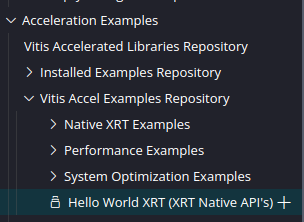

# Notes on AMD Vitis 2023.2

## General topics

General notes and thoughts about Vitis 2023.2

### Part number nomenclature

Commonly used parts | Part reference
---|---
Zynq UltraScale+ MPSoC ZCU102 | xczu9eg-ffvb1156-1-i
Alveo U250 | TBD

Speed grade is the number after the reference, with -1 being the slowest adn -3 being the fastest

Suffixes -i and -e denote industry and evaluation, respectively (needs confirmation)

### Recommended project structure

Root directory is the workspace folder, which you should create for each project/app. Do not mix unrelated components and source code in the same workspace, because it *will* get messy. For instance, if you have two applications **foo** and **bar**, we recommend the following structure:

- workspace folder "**foo**"
  - folder 1 (e.g., HLS component for the kernel part of **foo**)
  - folder 2 (e.g., Application component for the host part of **foo**)
  - src folder with the C/C++ code of **foo**
- workspace folder "**bar**"
  - etc etc

Different components can access the same source code, as long as you keep it in this structure. Regardless of whether you only want to synthesize a C/C++ kernel with an HLS component, or build a hybrid host-kernel application using OpenCL/XRT, it is important that you separate your kernel code in its own file. It should be isolated from all other code, such as the test bench code for an HLS kernel, or the host code for an hybrid application.

### License management

Licenses go on the root of $HOME/.Xilinx

## HLS Components

HLS components are for synthesizing C/C++ kernels, with no host components. Equivalent to the old Vitis HLS. Most relevant document: <https://docs.amd.com/r/en-US/ug1399-vitis-hls>

### Flow target

You can choose between Vivado and Vitis flow targets. The major difference is that the former generates a Vivado IP, leaving the integration up to you, while the latter prepackages the kernel with all the proper interfaces for interacting with the XRT/OpenCL APIs.

When specifying the Vitis Kernel Flow in the IDE, the tool implements interface ports using the AXI standard as described in Interfaces for Vitis Kernel Flow. If there are no existing INTERFACE pragmas or directives in the code, then the following interface protocols will be applied by default:

- AXI4-Lite interfaces (s_axilite) are assigned to scalar arguments, control signals for arrays, and the return value of the software function.
- AXI4 Master interfaces (m_axi) are assigned to pointer and array arguments of the C/C++ function.
- Vitis HLS automatically tries to infer BURST transactions whenever possible to aggregate memory accesses to maximize the throughput bandwidth and/or minimize the latency.
- Defining a software function argument using an hls::stream data type implies an AXI4-Stream (axis) port.

### Development Flows

- C Simulation - pure SW run, to validate test bench correctness
- C Synthesis - runs the first step of synthesis for a given kernel (i.e., outputs RTL in "impl", and the reports in "syn")
- C/RTL Cosimulation - emulates the generated RTL alongside the SW version to verify the correctness of the generated RTL
- Package - packages the RTL in the format specified in the project configuration. See output formats for more info
- Implementation - Place-and-route of the RTL into a bitstream. It may fail if it doesn't find a license for the target platform.

### Output Formats

Format|Filename|Purpose
---|---|---
Vivado IP | comp-name.zip | For adding to the Vivado IP catalog
Vivado IP for System Generator | comp-name.zip | For use with the Vivado edition of the System Generator for DSP
XO file | comp-name.xo | For linking with host code using Vitis and/or v++
RTL, skip packaging | VHDL and Verilog folders | Default behaviour, as these files are already generated by HLS in all instances

## Application Components

Application components are used to create hybrid CPU-FPGA applications. The Application component itself has the host code, while an HLS component has the kernel code. They are linked together using a Platform component.

## Concrete Examples

Here are some concrete instructions on how to use Vitis 2023.2. Hopefully one of these demonstration projects is sufficient to bootstrap the development of your app or kernel. These all assume you're running Ubuntu 22.10 or similar.

### Vadd application on the Alveo U250 (x86 system)

Start by downloading and installing the Alveo U250 board platform [using these instructions](https://www.xilinx.com/support/download/index.html/content/xilinx/en/downloadNav/alveo.html). It does not matter whether your computer has or hasn't an Alveo card installed.

Create a new workspace, and go to Examples > Acceleration Examples > Vitis Accel Examples Repository > Hello World XRT (XRT Native API's), and create one of those. If it doesn't appear in the list, there is likely a download button somewhere nearby:



You should see 3 components: a HLS component for vadd (vector addition), an Application component for the host code, and a Platform component for linking everything together. This is the one you'll be interacting with.

Run the Software Emulation by clicking "Build All", and then "Run".

Run the Hardware Emulation by clicking "Build All", and then click on "Run". Since your development PC has the same architecture as the target in an Alveo hybrid system (i.e., an x86_64 CPU), the emulator only needs to emulate the board; if the target CPU was, say, an ARM CPU, you'd also need to emulate the CPU and its associated OS. This is why the Alveo is the ideal target platform to experiment with, even if you end up targeting something else.

Finally, in "Hardware" you can finally build the application, with the place-and-route and linking steps. Click on "Build All", and enjoy the wait. The final product is located in TBD. Now, you have two options:

- If you're on a PC without an Alveo, the "Run" option will be greyed out. You can technically still run the final application by directly executing the ELF file, but it'll fail when loading up the XCLBIN. You need to copy the ELF + XCLBIN onto a PC with an Alveo;
- If you're on a PC with an Alveo that has been properly configured, the "Run" button should be clickable. To properly configure an Alveo, you need to flash it with the same firmware as the version you targeted. I do not cover how to do that here, as I do not remember how it is done.

### Vadd application on the ZCU102 (ARM system)

I'm basing this on a [tutorial for Vitis 2022.1 I found online](https://highlevel-synthesis.com/2022/06/09/how-to-emulate-an-hardware-accelerator-on-zcu102-in-vitis-2022-1/), adapting it for the 2023.2 version.

Download the [ZYNQMP common image](https://www.xilinx.com/member/forms/download/xef.html?filename=xilinx-zynqmp-common-v2023.2_10140544.tar.gz) for 2023.2. **It will not work with past versions**.

Unzip the file, and run `./sdk.sh -d ~/zcu102` to install the SDK to the $HOME directory. After it is done, copy the unzipped folder into `~/zcu102` as well. The folder should look like this after you're done:

```
~/zcu102
├── environment-setup-cortexa72-cortexa53-xilinx-linux
├── site-config-cortexa72-cortexa53-xilinx-linux
├── sysroots
│   ├── cortexa72-cortexa53-xilinx-linux
│   └── x86_64-petalinux-linux
├── version-cortexa72-cortexa53-xilinx-linux
└── xilinx-zynqmp-common-v2023.2
    ├── Image
    ├── README.txt
    ├── bl31.elf
    ├── boot.scr
    ├── rootfs.ext4
    ├── rootfs.manifest
    ├── rootfs.tar.gz
    ├── sdk.sh
    └── u-boot.elf
```

Take note of these 3 important files/folders, which you will need later:

- **sysroot**: `~/zcu102/sysroots/cortexa72-cortexa53-xilinx-linux`
- **rootfs**: `~/zcu102/xilinx-zynqmp-common-v2023.2/rootfs.ext4`
- **kernel image**: `~/zcu102/xilinx-zynqmp-common-v2023.2/Image`

Create a new workspace, and go to Examples > Vitis Accel Examples Repository > Hello World XRT (XRT Native API's), and create one of those. If it doesn't appear in the list, there is likely a download button somewhere in that list.

Select the ZCU102 as your target platform, and insert the sysroot, rootfs and kernel image paths specified above.

You should see 3 components: a HLS component for vadd (vector addition), an Application component for the host code, and a Platform component for linking everything together. This is the one you'll be interacting with.

Run the Software Emulation by clicking "Build All", and then "Run".

Run the Hardware Emulation by clicking "Build All", and then click on "Start Emulator". Wait until it boots up, and you're presented with a bash shell that you can interact with (not that you need to). Then, click on "Run" to run the HW Emulation. You cannot click on "Run" unless the emulator is running!

Finally, in "Hardware" you can finally build the application, with the place-and-route and linking steps. Click on "Build All", and enjoy the wait. The final product is located in TBD. You can then copy this onto a ZCU102 running PetaLinux in order to run on the actual hardware.
